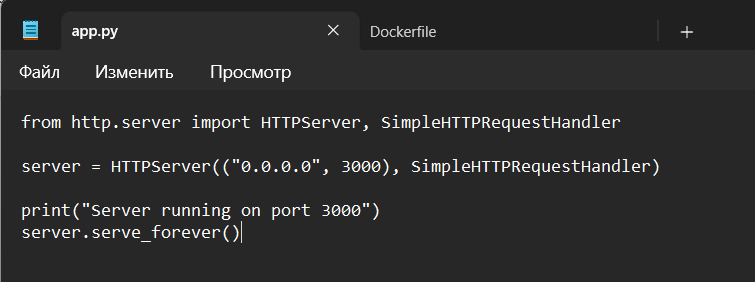
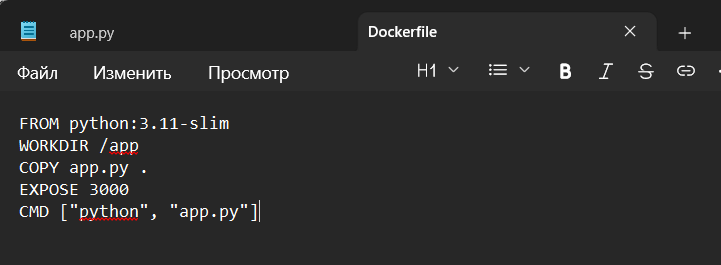
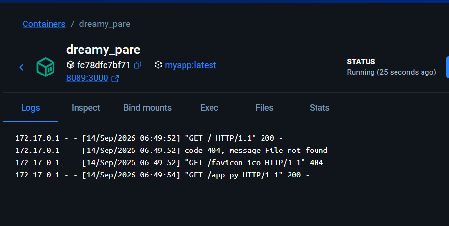
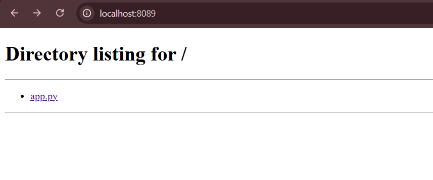

[Previous report](README_previous.md) | [Current report](README.md)

# Python HTTP Server with Docker

## 1. Create the Python server

I created `app.py` using Python's built-in `HTTPServer` and `SimpleHTTPRequestHandler`. The server listens on `0.0.0.0:3000` and serves files from its working directory.

## 2. Prepare the Dockerfile

I used `python:3.11-slim` as the base image, set `/app` as the working directory, and copied `app.py` into it. The Dockerfile declares port `3000` and starts the server with `python app.py`.

## 3. Run the container

I ran the `myapp:latest` image with host port `8089` mapped to container port `3000`. Docker Desktop showed the container running, and its logs recorded successful requests; the missing favicon returned `404`.

## 4. Check the result in the browser

I opened `http://localhost:8089` and saw a directory listing containing `app.py`. This confirmed that the browser could reach the Python server inside the container through the mapped port.
