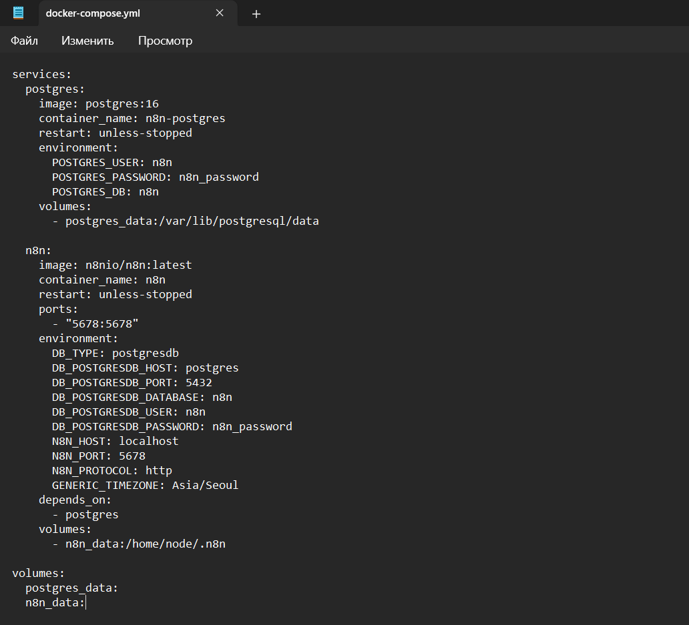
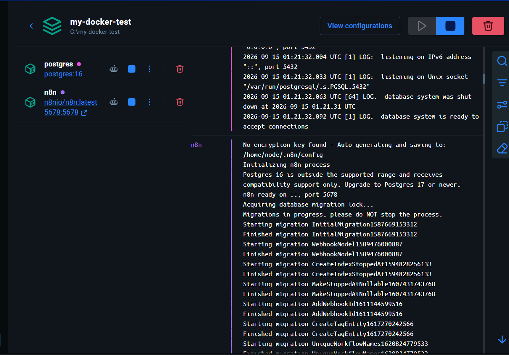
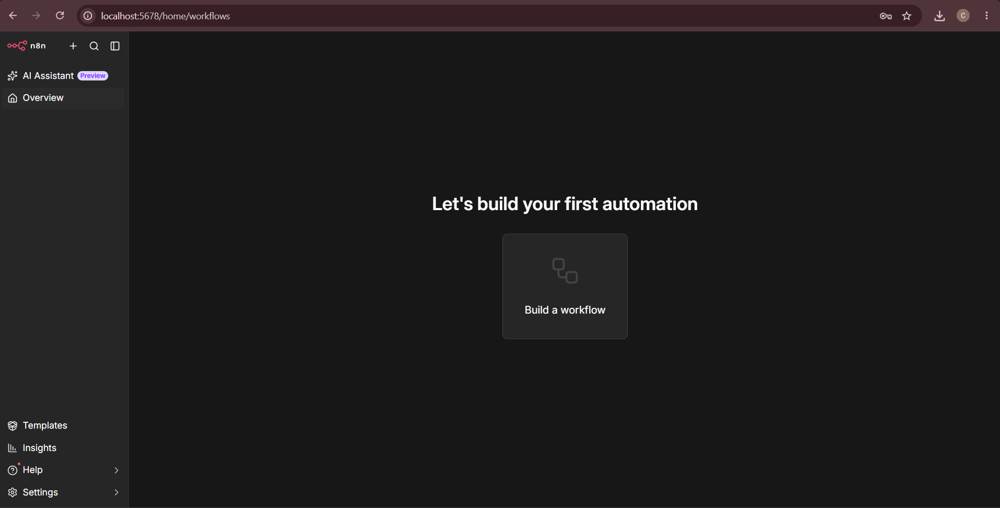

[Homework 1](../homework_1/README_1.md) | [Homework 2](../homework_2/README_2.md) | [Homework 3](../homework_3/gemini_workflow/README_3.md)

# Docker Compose: n8n with PostgreSQL

## 1. Overview

This task demonstrates how to run **n8n** and **PostgreSQL** together
using Docker Compose.

The Docker environment contains two services:

-   **PostgreSQL** --- stores the n8n database.
-   **n8n** --- provides the workflow automation interface.

Both services are started and managed together with Docker Compose.

------------------------------------------------------------------------

## 2. Docker Compose Configuration

A `docker-compose.yml` file was created to define the PostgreSQL and n8n
containers.

``` yaml
services:
  postgres:
    image: postgres:16
    container_name: n8n-postgres
    restart: unless-stopped
    environment:
      POSTGRES_USER: n8n
      POSTGRES_PASSWORD: n8n_password
      POSTGRES_DB: n8n
    volumes:
      - postgres_data:/var/lib/postgresql/data

  n8n:
    image: n8nio/n8n:latest
    container_name: n8n
    restart: unless-stopped
    ports:
      - "5678:5678"
    environment:
      DB_TYPE: postgresdb
      DB_POSTGRESDB_HOST: postgres
      DB_POSTGRESDB_PORT: 5432
      DB_POSTGRESDB_DATABASE: n8n
      DB_POSTGRESDB_USER: n8n
      DB_POSTGRESDB_PASSWORD: n8n_password
      N8N_HOST: localhost
      N8N_PORT: 5678
      N8N_PROTOCOL: http
      GENERIC_TIMEZONE: Asia/Seoul
    depends_on:
      - postgres
    volumes:
      - n8n_data:/home/node/.n8n

volumes:
  postgres_data:
  n8n_data:
```

The `postgres` service uses PostgreSQL 16 and creates a database for
n8n.\
The `n8n` service connects to PostgreSQL through the Docker network and
exposes n8n on port `5678`.




------------------------------------------------------------------------

## 3. Running the Containers

The containers are started with Docker Compose:

``` bash
docker compose up -d
```

Docker creates and starts both services defined in `docker-compose.yml`.

The running environment contains:

-   `postgres` --- PostgreSQL 16
-   `n8n` --- n8n workflow automation platform



------------------------------------------------------------------------

## 4. PostgreSQL and n8n Connection

n8n uses PostgreSQL as its database.

The connection is configured with the following environment variables:

``` text
DB_TYPE=postgresdb
DB_POSTGRESDB_HOST=postgres
DB_POSTGRESDB_PORT=5432
DB_POSTGRESDB_DATABASE=n8n
DB_POSTGRESDB_USER=n8n
DB_POSTGRESDB_PASSWORD=n8n_password
```

Because both containers are part of the same Docker Compose environment,
n8n can access the database using the service name `postgres`.

Docker volumes are also used to preserve data:

``` text
postgres_data
n8n_data
```

This allows PostgreSQL and n8n data to remain available even after the
containers are stopped or restarted.

------------------------------------------------------------------------

## 5. Accessing n8n

The n8n container maps container port `5678` to port `5678` on the host
machine.

After the containers start, the n8n interface can be accessed in a web
browser at:

``` text
http://localhost:5678
```

The successful loading of the n8n interface confirms that the n8n
container is running correctly.



------------------------------------------------------------------------

## 6. Result

The Docker Compose environment was successfully configured and launched.

PostgreSQL runs as the database service, while n8n runs as the workflow
automation service. The two containers communicate inside the Docker
Compose network, and n8n is available through port `5678`.

This setup provides a reusable Docker-based environment for further work
with n8n workflows.
